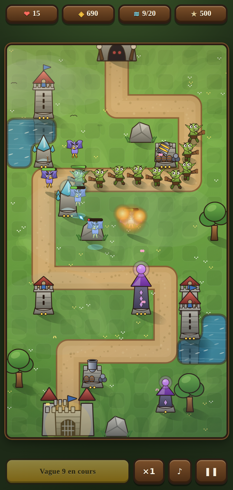
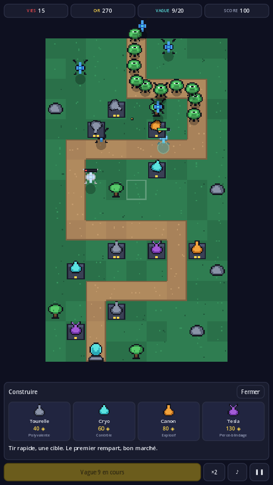
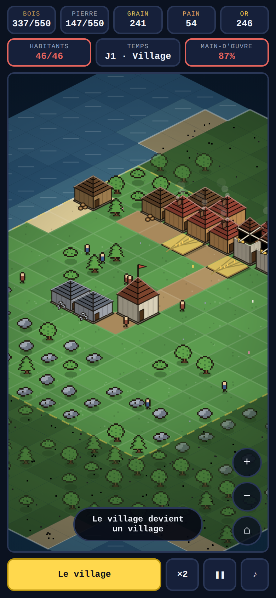

# Pixel Defense & Village

Deux jeux pensés pour le téléphone : on y joue au doigt, d'une seule main, sans
rien installer et sans réseau. Pas de moteur, pas de framework, pas de
`npm install` — du HTML, du CSS, un `<canvas>`, et des dessins tracés par le
code lui-même, courbe par courbe.

| Jeu | Genre | Où |
| --- | --- | --- |
| **Pixel Defense** | Tower defense médiéval, 20 vagues | racine du dépôt, plus un portage [Godot](godot) |
| **[Village](village)** | Bâtisseur isométrique, temps compressé | [`village/`](village) |

Les deux partagent la même façon d'être faits : une simulation qui ne connaît
que des cases et des secondes, un rendu qui est seul à parler en pixels, une
interface en vrais boutons — et un robot d'équilibrage qui joue des parties
entières en ligne de commande pour vérifier les réglages.

---

# Pixel Defense

Un **tower defense médiéval**, dessiné à la main — au sens propre : chaque
créature, chaque tour, chaque rocher est une suite de courbes tracées par le
code, cernées d'un contour brun et remplies de dégradés. Aucune image n'est
chargée depuis le réseau. Le parti pris graphique est celui des tower defense
peints à la *Kingdom Rush* : silhouette lisible d'abord, cerne épais, couleurs
franches, lumière toujours du même côté.

> Le style est repris, pas les dessins : rien ici ne vient d'un jeu existant.

Il existe en **deux versions, mêmes règles et mêmes chiffres** :

| | Où | Pour quoi faire |
| --- | --- | --- |
| **Web** | racine du dépôt | Jouer en un lien, s'installer sur l'écran d'accueil, fonctionner hors ligne. Aucune dépendance, aucun build : du HTML, du CSS, un `<canvas>`. |
| **Godot 4.4** | [`godot/`](godot) | Éditeur de scènes, export Android / iOS / bureau, et la suite du projet si le jeu grandit. **Le portage a gardé l'ancien habillage pixel** : seule la version web est peinte. |

Les deux partagent l'équilibrage au chiffre près : lancés sur le même robot de
simulation, ils donnent le même résultat (vague 16 pour une défense posée au
hasard, 20/20 pour une défense pensée — voir plus bas).

| Version web | Version Godot |
| --- | --- |
|  |  |

## Jouer

- **En ligne (version web)** : https://jlefebvre59320-hash.github.io/pixel-defense/
  (à activer une fois : *Settings → Pages → Source : GitHub Actions*).
- **Sur le téléphone** : ouvrir cette adresse, puis *Ajouter à l'écran
  d'accueil*. Le jeu s'installe comme une application et fonctionne ensuite
  **hors ligne**, en avion comme dans le métro.
- **En local, sans rien installer** : ouvrir `index.html` dans un navigateur.
  (Le mode hors ligne, lui, demande un vrai serveur : `python3 -m http.server`
  puis http://localhost:8000 — un service worker ne s'installe pas depuis un
  fichier local.)
- **Version Godot** : `godot --path godot`, ou ouvrir le dossier `godot/` dans
  Godot 4.4. Détails dans [Version Godot](#version-godot).

## Les règles

Vingt vagues sortent de la caverne, en haut de la carte, et descendent le
chemin jusqu'à votre forteresse. Chaque ennemi qui l'atteint coûte des vies.
À zéro, c'est fini.

- **Appuyez sur une case d'herbe** pour bâtir, **sur une tour** pour l'améliorer
  (trois niveaux) ou la revendre à 60 % du prix payé.
- **Appuyez sur une carte de tour et gardez le doigt** : la portée s'affiche
  avant l'achat. Relâchez pour construire.
- **Appelez la vague en avance** : chaque seconde d'avance rapporte 3 ◈.
  C'est là que se gagnent les parties serrées.
- **×1 / ×2 / ×3** accélère le jeu ; la difficulté ne change pas.

| Tour | Prix | Ce qu'elle fait |
| --- | --- | --- |
| **Tour d'archers** | 40 ◈ | Flèches rapides, une cible à la fois. Le premier rempart. |
| **Tour de givre** | 60 ◈ | Peu de dégâts, mais ralentit de 45 % : double le temps passé sous le feu des autres. |
| **Bombarde naine** | 80 ◈ | Lente, explosion de zone. La réponse aux meutes serrées. |
| **Tour de mages** | 130 ◈ | Trait arcanique instantané qui **traverse l'acier**. |

Quatre ennemis, et chacun punit une défense mal pensée :

| Ennemi | Particularité |
| --- | --- |
| **Gobelin** | L'ennemi de base, sans surprise. |
| **Loup** | Rapide et nombreux — une bombarde, ou la meute passe. |
| **Orc cuirassé** | Encaisse 4 dégâts sur **chaque** coup : les flèches ne le griffent pas. Mages ou bombarde. |
| **Harpie** | **Vole en ligne droite** vers la forteresse, ignore le chemin. Une défense massée le long du chemin ne la voit jamais passer. |
| **Troll géant** | Boss des vagues 10, 15 et 20. Cinq vies s'il passe. |

Clavier (sur ordinateur) : **Espace** pause · **N** vague suivante ·
**1–4** construire sur la case choisie · **S** vitesse · **Échap** fermer.

## Comment c'est fait (version web)

```
index.html          Structure : bandeau, plateau, panneau, barre de commandes
styles.css          Habillage bois et parchemin, mobile d'abord, cibles ≥ 44 px
js/config.js        Tout l'équilibrage : tours, ennemis, 20 vagues, économie
js/map.js           Grille 9×16, chemin déduit des points de passage, décor
js/art.js           Toutes les figures, tracées en courbes puis mises en cache
js/skin.js          Remplace une figure tracée par une image, quand il y en a une
js/storage.js       Record et préférences (localStorage, panne sans douleur)
js/audio.js         Bruitages de synthèse — aucun fichier son
js/render.js        Rendu canvas : décor peint une fois, tri par profondeur, effets
js/game.js          La simulation : vagues, déplacements, tirs, dégâts, or
js/ui.js            Interface DOM : compteurs, panneaux, écrans
js/main.js          Boucle, entrées, écrans, service worker
sw.js               Mise en cache hors ligne
tools/simulate.mjs  Robot d'équilibrage (Node, sans navigateur)
tools/make-icons.mjs Génère les icônes PNG
tools/png.mjs       PNG en lecture et en écriture, sans dépendance
tools/import-textures.mjs  Captures → atlas + manifeste (voir plus bas)
tools/tests/test-textures.mjs  Banc de l'import, sans navigateur
skins/              Habillages engendrés (vides et non versionnés par défaut)
```

Trois partis pris qui expliquent le reste :

1. **Le moteur ne connaît que des cases et des secondes.** Aucune position en
   pixels, aucune vitesse « par image » : le jeu se comporte pareil sur un
   téléphone à 60 Hz et sur un écran à 120 Hz, et le mode ×3 se résume à
   multiplier le temps écoulé.
2. **Le rendu est seul à parler en pixels.** Le décor, qui ne bouge jamais,
   est peint une fois dans un canvas hors écran ; les figures sont tracées une
   fois puis recopiées à l'échelle. Tours et ennemis sont triés par leur
   position verticale avant d'être dessinés — sans ce tri, un ennemi passerait
   parfois derrière une tour qu'il devrait masquer.
3. **L'interface est du DOM, pas du canvas.** Les boutons sont de vrais
   boutons : lisibles au lecteur d'écran, utilisables au clavier, et le doigt
   tombe sur des cibles d'au moins 44 px.

### Régler l'équilibrage

Tout est dans `js/config.js` (prix, dégâts, portées, cadences, composition des
vagues, économie). Pour vérifier un réglage sans jouer trois heures :

```
node tools/simulate.mjs 3
```

Le moteur se charge dans Node sans navigateur et fait jouer trois profils. Un
réglage sain se lit ainsi : le profil « novice » (des tourelles au hasard,
jamais d'amélioration) tombe avant la fin, le profil « correct » gagne en
gardant des vies. La version Godot a le même outil
(`godot --path godot --headless --script tools/simulate.gd -- 3`) et sort les
mêmes chiffres — c'est ainsi qu'on vérifie que les deux versions n'ont pas
divergé.

```
novice   {"issue":"perdu","vague":16,"vies":0,"score":22270,"tours":82}
correct  {"issue":"gagné","vague":20,"vies":15,"score":47599,"tours":21}
```

### Changer les dessins

Tout est dans [`js/art.js`](js/art.js). Chaque figure est une fonction qui
trace des courbes dans une boîte de référence, avec trois outils partagés :
`fs()` cerne puis remplit (le contour d'abord, sinon il n'y a pas de cerne),
`shade()` donne le dégradé — clair en haut, sombre en bas, la même lumière
pour tout le jeu —, et `limb()` trace un membre.

Chaque figure porte sa boîte et son **point d'ancrage** : les pieds pour ce qui
marche, la base pour ce qui est posé au sol, le centre pour ce qui vole. Le
rendu place l'ancrage, jamais le coin — c'est ce qui fait qu'une tour de trois
étages reste plantée sur sa case au lieu de flotter, et qu'une barre de vie se
pose juste au-dessus d'une harpie comme d'un troll.

Ce qu'on pose *sur* une figure — la bouche de la bombarde, l'orbe du mage —
n'est pas repéré en fractions de case dans le rendu mais déclaré à côté du
tracé, dans `mark()`. Les deux dérivaient dès qu'on retouchait la hauteur d'un
mur.

Un contrôle au chargement (`Art.validate()`) trace chaque figure une fois et
signale dans la console celles qui manquent ou qui échouent. Les icônes de
l'application se régénèrent avec `node tools/make-icons.mjs`.

### Habiller le jeu avec un pack de textures

Le dessin par code est le **défaut**, pas une fatalité : n'importe quelle
figure peut être remplacée par une image. La chaîne va d'un pack Unreal
jusqu'au jeu, et chaque maillon se vérifie tout seul.

```
        pack Unreal
             │   bridge.py run-job list_pack.json        ← qu'y a-t-il dedans ?
             │   bridge.py run-job export_sprites.json   ← une photo par figure
             ▼
      captures PNG (fond magenta)
             │   node tools/import-textures.mjs <dossier> --name mon-pack
             ▼
   skins/mon-pack/atlas.png + atlas.js
             │   <script src="skins/mon-pack/atlas.js"></script>
             ▼
           le jeu
```

Trois choix qui expliquent le reste :

1. **Le moteur photographie, il ne découpe pas.** Sortir un alpha propre d'un
   `SceneCapture` demande des réglages qui changent d'une version d'Unreal à
   l'autre. Le fond est donc peint d'une couleur franche, et le détourage se
   fait côté Node — là où il est testable, et où il l'est.
2. **Le repli est toujours possible, figure par figure.** Une figure absente
   de l'habillage reste tracée. On peut habiller les gobelins un jour et les
   tours le mois suivant sans que rien ne casse entre-temps.
3. **Le manifeste est du JavaScript, pas du JSON.** Le jeu s'ouvre depuis un
   simple fichier local, où `fetch` est interdit par la politique d'origine.
   Un `<script>` passe.

Le cadrage des captures est commun à toutes les figures — une boîte de
`frame_cm` centimètres — et l'atlas retient la taille de chaque capture avant
rognage. C'est ce qui garde les tailles relatives : un troll sort plus gros
qu'un gobelin sans réglage, et rogner une marge ne fait pas grandir la figure.

Détail des noms de figures, des ancrages et des licences :
[`skins/README.md`](skins/README.md).

```
node tools/tests/test-textures.mjs      # 23 vérifications, sans navigateur
```

## Version Godot

Le même jeu, porté sur **Godot 4.4**, dans le dossier [`godot/`](godot). Même
carte, mêmes tours, mêmes vagues, mêmes chiffres : `godot/scripts/config.gd`
est la copie GDScript de `js/config.js`.

```
godot --path godot                       # jouer
godot --path godot --headless --script tools/simulate.gd -- 3   # équilibrage
```

Ou, sans ligne de commande : ouvrir Godot, *Importer*, choisir le dossier
`godot/`.

```
godot/project.godot         Réglages : portrait, rendu GL Compatibility, pixels nets
godot/scenes/Main.tscn      Structure de l'écran (la seule scène à ouvrir dans l'éditeur)
godot/scripts/config.gd     Équilibrage — l'unique fichier à toucher pour régler la difficulté
godot/scripts/map_data.gd   Grille, chemin déduit des points de passage, décor
godot/scripts/sim.gd        La simulation : vagues, tirs, dégâts, économie
godot/scripts/board.gd      Vue du plateau : terrain, sprites des tours et des ennemis
godot/scripts/fx.gd         Barres de vie, portées, explosions, éclairs, or qui s'envole
godot/scripts/ui.gd         Interface : compteurs, panneaux, écrans de fin
godot/scripts/main.gd       Boucle, entrées, enchaînement des écrans
godot/scripts/art.gd        Sprites en texte → textures, terrain peint une fois
godot/scripts/sfx.gd        Bruitages fabriqués à la volée (aucun fichier son)
godot/tools/simulate.gd     Robot d'équilibrage, sans fenêtre ni rendu
```

Trois choix de structure méritent une explication :

1. **`sim.gd` ne connaît ni nœud, ni texture, ni pixel.** Il fait avancer la
   partie à partir d'un temps écoulé et prévient le reste par des signaux
   (`enemy_died`, `wave_started`, `explosion`…). D'où le mode ×2/×3 gratuit, et
   surtout un robot qui joue vingt vagues en une seconde, sans fenêtre.
2. **`config.gd` et `map_data.gd` ne sont pas des autoloads** mais des classes
   chargées par `preload`, avec des membres statiques : les autoloads
   n'existent pas en mode `--script`, et le robot d'équilibrage doit tourner
   sur un dépôt fraîchement cloné, avant tout passage par l'éditeur.
3. **L'interface est faite de vrais `Control`**, pas de dessins dans le
   plateau : texte net, boutons de 44 px, clavier gratuit. Le plateau, lui, est
   un `Node2D` mis à l'échelle par pas d'un demi-pixel d'art — en tenant compte
   de l'étirement appliqué par Godot, sinon un pixel d'art ferait 3 pixels
   d'écran ici et 4 juste à côté.

**Mode démo** — le jeu se joue tout seul, défense posée et vagues appelées.
Sert à vérifier le rendu et à refaire les captures :

```
godot --path godot --write-movie captures/f.png --fixed-fps 30 --quit-after 200 -- --demo
```

**Export Android.** Dans l'éditeur : *Éditeur → Gérer les modèles d'export*
(installer les modèles 4.4), puis *Projet → Exporter → Ajouter → Android*.
Il faut le SDK Android (Android Studio suffit) et un keystore de signature —
*Éditeur → Paramètres → Export → Android*. Le fichier `export_presets.cfg`
n'est **pas versionné à dessein** : Godot y écrit le mot de passe du keystore.
Godot exporte aussi vers le web, mais la version HTML de ce dépôt reste plus
légère et démarre plus vite : autant garder chacun sur son terrain.

## Mise en ligne

Chaque `push` sur `main` déclenche `.github/workflows/pages.yml`, qui publie le
dépôt tel quel sur GitHub Pages (il n'y a rien à compiler ; la version Godot
est simplement ignorée par le navigateur). La première fois, il faut activer
Pages : **Settings → Pages → Source : GitHub Actions**.

Après une modification, penser à changer le numéro de version en tête de
`sw.js` (`pixel-defense-v1` → `v2`) : c'est ce qui remplace le cache des
joueurs qui ont déjà installé le jeu.

---

# Village

Un **bâtisseur de village en 2D isométrique**, dans le dossier
[`village/`](village). Même esprit que Pixel Defense — du HTML, du CSS, un
`<canvas>`, aucune dépendance — mais un jeu tout autre : on ne défend pas, on
construit.



**Le principe.** Une clairière, six habitants, une hache. Chaque journée dure
six secondes : les habitants mangent, la population grandit si le grenier
suit, et le village devient tour à tour hameau, bourg, puis ville à
120 âmes.

**Ce qui fait le jeu, c'est le placement.** Chaque bâtiment annonce, avant
l'achat, ce qu'il produirait *sur cette case précise* : une bûcheronnerie vaut
0,90 bois/s au milieu d'un bosquet et 0,15 en pleine prairie ; un champ étouffé
entre deux maisons ne nourrit personne. Trois contraintes s'entremêlent :

- **les vivres** — un habitant mange 0,9 ration par jour, le pain en vaut deux,
  d'où le moulin ;
- **la main-d'œuvre** — 60 % des habitants travaillent ; trop d'ateliers pour
  trop peu de monde et tout tourne au ralenti, à commencer par les champs ;
- **la place** — le territoire est un carré doré qu'on repousse à prix d'or.

Se déplacer : **glisser** ; zoomer : **+ / −** ou le pincement ; construire :
**appuyer sur une case libre**. La partie se sauvegarde toute seule et se
reprend au même endroit.

```
village/js/config.js    Tout l'équilibrage : bâtiments, économie, rythme du temps
village/js/world.js     Carte tirée d'un bruit déterministe, territoire, voisinage
village/js/iso.js       Projection isométrique, caméra, désignation d'une case
village/js/art.js       Dessin : volumes, toitures, sprites en caractères
village/js/sim.js       La simulation : production, vivres, population, or
village/js/render.js    Une trame : sol, tri par profondeur, passants
village/js/ui.js        Interface DOM : bandeau, panneaux, écrans
village/js/main.js      Boucle, doigt, écrans, sauvegarde
village/tools/simulate.mjs  Robot d'équilibrage (Node, sans navigateur)
```

### Régler l'équilibrage

```
cd village && node tools/simulate.mjs 3
```

Le simulateur fait jouer trois profils et sort la seule chose qui compte : un
village bien tenu atteint-il la ville, un village mal tenu meurt-il ?

```
novice   {"issue":"village vidé","jour":14,"habitants":0,"sommet":9}
prudent  {"issue":"ville","jour":109,"habitants":120,"famines":0}
gourmand {"issue":"inachevé","jour":600,"habitants":36}
```

C'est cet outil qui a débusqué les deux défauts de conception du premier jet :
un village sans bois ne pouvait plus jamais bâtir la bûcheronnerie qui produit
le bois (d'où la corvée de l'hôtel de ville), et un territoire plein sans
marché ne pouvait plus jamais s'agrandir (d'où l'impôt). Le profil
« gourmand », lui, décrit un vrai piège du jeu : entasser les champs par
prudence consomme le bois qui manquera ensuite pour loger qui que ce soit.

---

# Pont Unreal

Un outil, pas un jeu : [`tools/unreal_bridge/`](tools/unreal_bridge) exécute du
Python **dans un éditeur Unreal ouvert**, depuis le terminal.

```
python3 tools/unreal_bridge/bridge.py ping
python3 tools/unreal_bridge/bridge.py run-script unreal/Content/Python/healthcheck.py
python3 tools/unreal_bridge/bridge.py run-job tools/unreal_bridge/jobs/list_pack.json
python3 tools/unreal_bridge/bridge.py run-job tools/unreal_bridge/jobs/export_sprites.json
```

C'est par là que passent les packs de textures : `list_pack` dit ce que
contient le pack, `export_sprites` en photographie les maillages en vue 3/4,
et [`tools/import-textures.mjs`](tools/import-textures.mjs) en fait la planche
que le jeu charge — voir *Habiller le jeu avec un pack de textures*.

Sur macOS, le moteur est repéré tout seul dans `/Users/Shared/Epic Games/UE_*`
(la version la plus récente d'abord), et `--verbose` dit en une ligne si le
multicast passe — c'est presque toujours l'autorisation **Réseau local** qui
manque.

> Le pont n'a jamais parlé à un vrai éditeur : Unreal n'est pas installable là
> où ce code a été écrit. Il est vérifié contre un faux éditeur qui rejoue le
> protocole. Détails et limites : [`tools/unreal_bridge/README.md`](tools/unreal_bridge/README.md).

```
python3 tools/unreal_bridge/tests/test_bridge.py
```

## Licence

MIT — voir [LICENSE](LICENSE).
